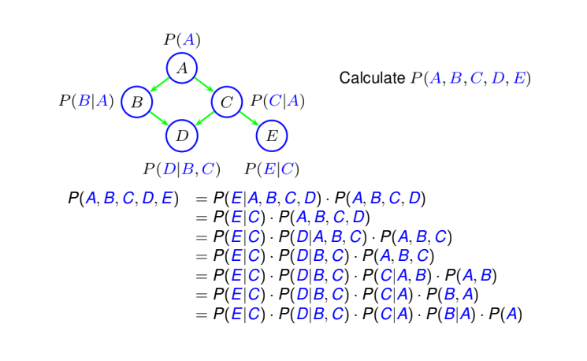

# Overview

### Formulate Queries (10%)
```pl
age(5). age(10). age(15).

    % ?- age(A), not((age(B), A < B)).
    % => A = 15
```

### Structures (8%)
#### Binary Tree
```pl
tree(0, 
    tree2(a,
        2, tree2(b, 0, none, 0, none),
        7, tree2(c,
            3, tree2(d, 0, none, 0, none),
            8, tree2(e, 0, none, 0, none)
        )
    )
).

traverse(tree2(S, 0, none, 0, none)).
traverse(tree2(S, AVal, A, 0, none)) :- traverse(A), write(AVal), nl.
traverse(tree2(S, 0, none, BVal, B)) :- traverse(B), write(BVal), nl.
traverse(tree2(S, AVal, A, BVal, B)) :-
    traverse(tree2(S, AVal, A, 0, none)),
    traverse(tree2(S, 0, none, BVal, B)).

    % ?- tree(0, T), traverse(T). % THIS IS FOR INORDER TRAVERSAL !
    % => 2, 3, 7, 8
    %
    %       /\
    %      2  7
    %        /\
    %       3  8
```
#### Linked List
```pl
list(0, node(3, node(11, node(5, nil)))).

sumNodes(nil, 0).
sumNodes(node(H, T), N) :- sumNodes(T, R), N is R + H.
    % ?- list(0, L), sumNodes(L, S).
    % => S = 19
```

### Recursion Over Lists and Terms (15%)
```pl
append([], L2, L2).
append([H|T], L2, [H|R]) :- append(T, L2, R).

member(E, [E|_]).
member(E, [_|T]) :- member(E, T).

length([], 0).
length([_|T], N) :- length(T, R), N is R + 1.

sum([], 0).
sum([H|T], N) :- sum(T, R), N is R + H.
```
```pl
all_diff([]).
all_diff([N|L]) :- not(member(N,L)), all_diff(L).

replaceOne(_, _, [], []).
replaceOne(X, Y, [X|T], [Y|L]) :- replaceOne(X, X, T, L).
replaceOne(X, Y, [H|T], [H|L]) :- not(X = H), replaceOne(X, Y, T, L).

replaceAll(_, _, [], []).
replaceAll(X, Y, [X|T], [Y|L]) :- replaceAll(X, Y, T, L).
replaceAll(X, Y, [H|T], [H|L]) :- not(X = H), replaceAll(X, Y, T, L).

reversePosNeg([], [], []).
reversePosNeg([H|T], P, R) :- H < 0, reversePosNeg(T, P, N), append(N, [H], R).
reversePosNeg([H|T], R, N) :- H >= 0, reversePosNeg(T, P, N), append(P, [H], R).
```
#### Blocks World
```pl
on(b1,b2).
on(b3,b4).
on(b4,b5).
on(b5,b6).
just_left(b2,b6).
just_left(b6,b7).
above(X,Y) :- on(X,Y).
above(X,Y) :- on(X,Z), above(Z,Y).
left(X,Y) :- above(X,Z), left(Z,Y). % X is high
left(X,Y) :- above(Y,Z), left(X,Z). % X is low
left(X,Y) :- just_left(X,Y).
left(X,Y) :- just_left(X,Z), left(Z,Y).
right(X,Y) :- left(Y,X).

    % ?- above(b1,b6).
    % => false
```

### Constraints / CSP (12%)
```pl
% Example: SEND + MORE = MONEY

dig(0). dig(1). dig(2). dig(3). dig(4).
dig(5). dig(6). dig(7). dig(8). dig(9).
```
#### Pure Generate and Test
```pl
solve([S,E,N,D,M,O,R,Y]) :-
    dig(S), dig(E), dig(N), dig(D),
    dig(M), dig(O), dig(R), dig(Y),
    S > 0, M > 0,
    Y is (D+E) mod 10, C1 is (D+E) // 10,
    E is (N+R+C1) mod 10, C10 is (N+R+C1) // 10,
    N is (E+O+C10) mod 10, C100 is (E+O+C10) // 10,
    O is (S+M+C100) mod 10, M is (S+M+C100) // 10,
    all_diff([S,E,N,D,M,O,R,Y]).
    % ?- solve(L).
    % => 167 minutes of computing time ...
```
#### Interleaving of Generate and Test
```pl
solveBest([S,E,N,D,M,O,R,Y]) :-
    dig(D), dig(E),
    Y is (D+E) mod 10, C1 is (D+E) // 10,
    dig(N), dig(R),
    E is (N+R+C1) mod 10, C10 is (N+R+C1) // 10,
    dig(E), dig(O),
    N is (E+O+C10) mod 10, C100 is (E+O+C10) // 10,
    dig(S), S > 0, dig(M),
    O is (S+M+C100) mod 10, M is (S+M+C100) // 10,
    M > 0,
    all_diff([S,E,N,D,M,O,R,Y]).
    % ?- solveBest(L).
    % => L = [9, 5, 6, 7, 1, 0, 8, 2]
```

### Natural Language Processing (20%)
#### Concepts
- **Database:** stores facts, defines model of world
- **Lexicon:** specifies vocabulary and words of interest


- **Parser:** grammatical rules to form statements (uses a *Grammar*)
- **Grammar:** formal system of language structure

#### Grammar
```
1   S -> NP VP
2   VP -> copula_verb Mods
3   VP -> transitive_verb NP Mods
4   VP -> intransitive_verb Mods
5   NP -> proper_noun
6   NP -> article NP2
7   NP2 -> adjective NP2
8   NP2 -> common_noun Mods
9   Mods -> []
10  Mods -> PP Mods
11  PP -> preposition NP
```
```
S: sentence
    => NP + VP
    "the packed lunch is in the house on the table getting cold"

VP: verb phrase
    => (copula_verb / (transitive_verb + NP) / intransitive_verb) + Mods
    "getting"
    "paying a visit"
    "sitting"

NP: noun phrase
    => proper_noun / (article + adjectives? + common_noun + Mods)
    "Ryan"
    "the packed lunch"

PP: preposition phrase
    => preposed NP
    "in the house"

Mods: modifier
    => PPs?
    "in the house on the table"
```

#### Parse Trees


#### Database
```pl
person(john). job(john, doctor). size(john, small).
person(grace). job(grace, doctor). size(grace, big).
person(mark). job(mark, programmer). size(mark, small).
person(linda). job(linda, programmer). size(linda, small).

park(qbeach). park(queens_park).
tree(tree01). size(tree01, big).
tree(tree02). size(tree02, small).
tree(tree03). Size(tree03, small).
...
```
#### Lexicon
```pl
article(a).
article(the).

common_noun(park, X) :- park(X).
common_noun(tree, X) :- tree(X).
common_noun(hat, X) :- hat(X).
common_noun(programmer, X) :- job(X, programmer).
common_noun(doctor, X) :- job(X, doctor).
common_noun(doc, X) :- job(X, doctor).
common_noun(doctor, X) :- hasPhD(X).
common_noun(medical_doctor, X) :- job(X, doctor), hasMD(X).

proper_noun(Noun) :- person(Noun).

adjective(big, X) :- size(X, big).
adjective(small, X) :- size(X, small).
adjective(red, X) :- colour(X, red).
adjective(blue, X) :- colour(X, blue).

preposition(on, X, Y) :- on(X, Y).
preposition(in, X, Y) :- in(X, Y).
preposition(beside, X, Y) :- beside(X, Y).
preposition(beside, X, Y) :- beside(Y, X).

preposition(with, X, Y) :- on(X, Y).
preposition(with, X, Y) :- in(X, Y).
preposition(with, X, Y) :- beside(X, Y).
preposition(with, X, Y) :- beside(Y, X).
```
#### Parser
```pl
% How we are going to ask Qs (driver)
who(Words, Ref) :- np(Words, Ref).

% NP -> proper_noun
np([Name], Name) :- proper_noun(Name).

% NP -> article NP2
np([Art | Rest], Who) :- article(Art), np2(Rest, Who).

% NP2 -> adjective NP2
np2([Adj | Rest], Who) :- adjective(Adj, Who), np2(Rest, Who). 

% NP2 -> common_noun Mods
np2([Noun | Rest], Who) :- common_noun(Adj, Who), mods(Rest, Who). 

% Mods -> []
mods([], Who). 

% Mods -> PP Mods
mods(Words, Who) :- append(Start, End, Words), 
pp(Start, Who), mods(End, Who).

% PP -> preposition NP
pp([Prep | Rest], Who) :- preposition(Prep, Who, Who2), np(Rest, Who2). 
```
#### Querying
Normal Query
```pl
?- who([a, doctor, with, a, big, hat], X).
X = grace
```
Competion & Generation
```pl
?- who([the, W, on, john], hat01).
W = hat

?- who(L, linda).
L = linda ;
Execution gets stuck in recursion constructing "a small small small ..."

?- L = [a, _, _, _, _], who(L, linda).
L = [a, small, small, small, programmer]
L = [a, small, programmer, in, queens_park]
L = [a, small, programmer, with, mark]
...

```
Interrogative Sentences
```pl
WH -> wh_word copula_verb NP    % What is X?
WH -> wh_word copula_verb PP    % Who is in X?

```
Yes/No Questions
```pl
YN -> copula_verb NP NP    % Is X a Y?
YN -> copula_verb NP PP    % Is X with Y?
```

### Short Essay General Question (5%)

TBD

### Problem Solving / Planning (25%)

#### Problem Solving Concepts
The predicate `reachable(S,L)` means the state `S` is reachable using list of moves `L`:

An initial state `S` is reachable and no moves are required:
```pl
reachable(S, []) :- initial_state(S).
```
If `S` is reachable using moves `L` and legal move `M` from `S` to `S1`, then `S1` is reachable using moves `[M|L]`:
```pl
reachable(S1, [M|L]) :- reachable(S, L), legal_move(S1, M, S).
```

To solve a problem, we try to reach a goal state:
```pl
solve_problem(L) :- reachable(S, L), goal_state(S).
```
A problem is solvable using a list of moves `L` if some goal state `S` is reachable using `L`.

#### General Problem Solver
For each specific problem we only need to specify the predicates:
- `initial_state(S)`
- `goal_state(S)`
- `legal_move(S1, M, S)`

In the first stage of `reachable(S1, [M|L])`, apply `reachable(S, L)`. This is `reachable(S1, [M|L])`'s history.

In the second stage of `reachable(S1, [M|L])`, search for legal move `legal_move(S1, M, S)` to get the next move:
```pl
% Example

legal_move([X1,Y,Z],flip_left,[X,Y,Z]) :- flip(X,X1).
legal_move([X,Y1,Z],flip_middle,[X,Y,Z]) :- flip(Y,Y1).
legal_move([X,Y,Z1],flip_right,[X,Y,Z]) :- flip(Z,Z1).

flip(h,t).
flip(t,h).
```

Some general information regarding problem solving predicates:
- **legal_move(S2, M, S1):** useful in it takes on two forms:
    - For **state-based approach**: `legal_move(S', M, S)` where representation of state are explicit lists (not entirely feasible in practice)
    - For **situations & fluents approach**: `legal_move([A | S], A, S) :- poss(A, S)` alongside `initial_state([])` to generalize all possibilities from `S`
- **max_length(L, N):** holds when the length of list `L` is not more than `N`
    - Can be used to bound the number of actions allowed by `reachable`
- **reverse(L1, L2):** returns a list `L2` such that it contains the elements of `L1` in reversed order
    - Can be used to list actions in the "correct" order

Code Example:
```pl
loc(loc1). loc(loc2). loc(loc3). loc(loc4).

initial_state([loc3,loc4,loc1,n,n]).
goal_state([_,_,_,_,y]).

legal_move(S1,climb_off,S) :- legal_move(S,climb_on,S1).
legal_move([B,L,L,y,H],climb_on,[B,L,L,n,H]).
legal_move([L,L,L,y,y],grab,[L,L,L,y,n]).
legal_move([B,X,L,n,H],go(X),[B,M,L,n,H]) :- loc(X), not(X=M).
legal_move([B,X,X,n,H],push(X),[B,M,M,n,H]) :- loc(X), not(X=M).
```
#### Planning
Used to meet some goal we are interested in achieving (i.e. solve a problem) by sending actions to the robot for execution. In typical problem solving, exploring all aspects of a state in a big list can be too time-consuming, and there can be too many objects with too many properties to list them all in each clause of `legal_move`.

Instead, we use *situations* and *fluents*. We are able to describe the problem incrementally without having to know in advance all possible actions and fluents, by only identifying relevant actions. This generalizes common actions and simplifies managing complex states with large number of properties.

- **Situation:** sequence of actions `S` which represents the current state and its history
- **Fluent:** predicates that are used to state facts about the world (e.g. `on_box(S)`, `location(Thing, Loc, S)`)

Code Example:
```pl
loc(loc1). loc(loc2). loc(loc3). loc(loc4).
banana_location(loc3).

goal_state(S) :- has_bananas(S).

poss(grab,S) :- on_box(S), banana_location(L), location(box,L,S).
poss(climb_on,S) :- location(monkey,L,S), location(box,L,S), not(on_box(S)).
poss(climb_off,S) :- on_box(S).
poss(go(X),S) :- loc(X), location(monkey,L,S), not(X=L), not(on_box(S)).
poss(push(X),S) :- loc(X), location(monkey,L,S), location(box,L,S), not(X=L), not(on_box(S)).

on_box([climb_on|S]).
on_box([A|S]) :- not(A=climb_off), on_box(S).

has_bananas([grab|S]).
has_bananas([A|S]) :- has_bananas(S).

location(monkey,X,[go(X)|S]).
location(monkey,X,[push(X)|S]).
location(monkey,X,[A|S]) :- not(A=go(_)), not(A=push(_)), location(monkey,X,S).
location(box,X,[push(X)|S]).
location(box,X,[A|S]) :- not(A=push(_)), location(box,X,S).
location(monkey,loc4,[]).
location(box,loc1,[]).
```
#### Precondition Axioms
For a `legal_move`, they define when an action can be executed, by using the `poss(Action, Situation)` predicate.

For States = [*bananas*, *monkey*, *box*, *OnBox?*, *HasBananas?*]:
```pl
legal_move([X, L, L, no, Y], climbOffBox, [X, L, L, yes, Y]).

% to

legal_move([A | S], A, S) :- poss(A, S).
poss(climbOffBox, Sit) :- on_box(Sit).
```
#### Successor-State Axioms
For a `legal_move`, they define how the action affects the state. Ultimately, it asks whether a fluent holds in `[A | S]` given that it did (or not) in `S`.

Checking whether the `climbOnBox` action occurred in the past using `on_box`:
```pl
% Positive Effect
on_box([climbOnBox | S]).

% Persistence Rule
on_box([A | S]) :- not(A = climbOnBox), on_box(S).
```

My definition for general form of successor-state axioms:
```pl
fluent(X1, ..., XN, [ActionThatMakesTrue | S]) :- if_condit_holds(X1, ..., XN, S).
fluent(X1, ..., XN, [A | S]) :- fluent(X1, ..., XN), not(A = ActionThatMakesFalse), not(A = ActionThatMakesTrue).
```

For negative effect rules, write a conjunction of the form (`not(A=act1), not(A=act2), ...`) on the R.H.S of the rule.

#### Complexity

TBD

#### DFS & BFS

TBD

#### Declarative Heuristics
The predicate `useless(M, History)` is `true` if `M` is a redundant action to do given the list `History` of actions that have been performed already. As a result, it can reduce time spent by cutting down redundant situation branches.
```pl
useless(up(X), [down(X) | List]).
useless(down(X), [up(X) | List]).
useless(left(X), [right(X) | List]).
useless(right(X), [left(X) | List]).
```
### Bayesian Networks (15%)

A Bayesian Network (BN) is a directed acyclic (no cycles) graph. Each node is a random variable with a finite set of values that are mutually exclusive and exhaustive. The links represent cause–effect relation.

- **Joint Probability Distribution (JBD):** corresponding probability distribution on all possible pairs of outputs for any number of random variables
- **Random Variable (RV):** a quantity having a numerical value for each member of a group, such as how flipped coin having sample space `{H, T}`, can for example correspond to `{-1, 1}`



How many numbers do we need to define `P(A, B, C, D, E)` if all RV are binary?
We need 1 number to define `P(A)`, 2 numbers to define `P(B|A)`, 4 numbers to
define `P(D|B, C)`, 2 numbers to define `P(C|A)` and 2 more for `P(E|C)`, i.e.
`1 + 2 + 4 + 2 + 2 = 11` numbers in total vs. `25 − 1 = 31` without a BN structure.